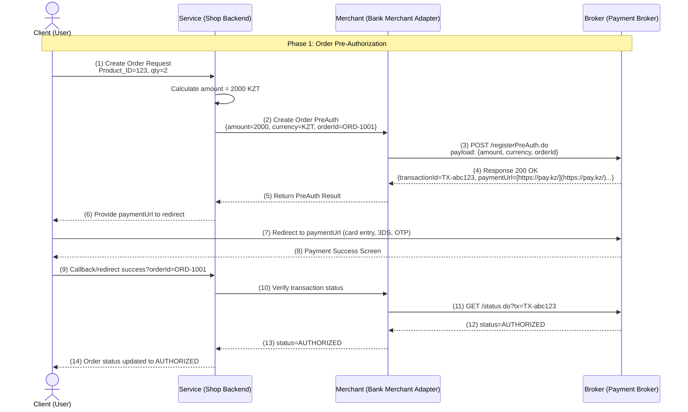
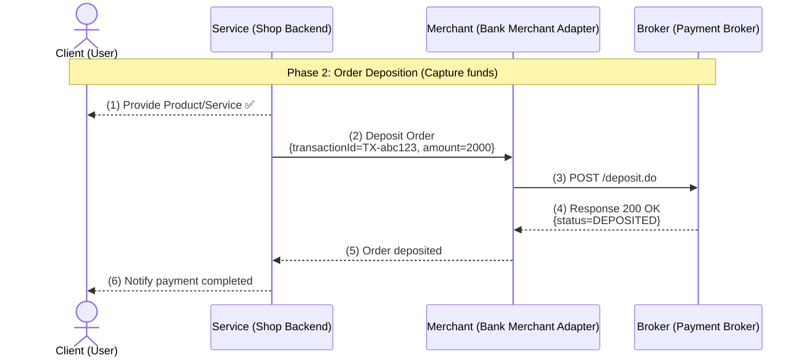
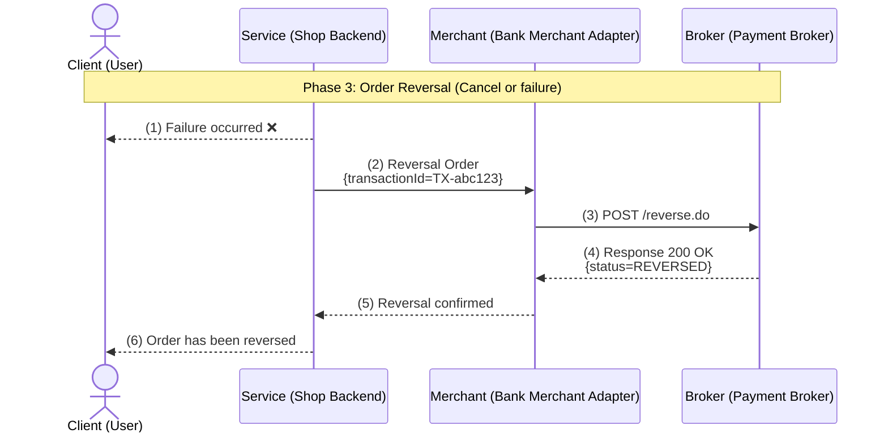

# 💳 API для мерчантов Bereke Bank

---

Эта Go-библиотека предназначена для интеграции с эквайринговой платформой Bereke Bank. С её помощью вы сможете легко регистрировать новые заказы, отслеживать их текущий статус, а также выполнять операции по возврату средств, отмене и аннулированию (сторно) транзакций, обеспечивая полный контроль над финансовыми потоками.

---

## 🚀 Основные возможности

API для мерчантов Bereke Bank предоставляет следующие ключевые функции:

* ✅ **Регистрация заказа** (`RegisterOrder`): Создавайте новые платежные заказы в системе.
* 🔎 **Проверка статуса заказа** (`OrderStatus`): Предоставляет информацию о статусе любого существующего заказа.
* 💸 **Возврат средств** (`RefundOrder`): Инициируйте возврат денег по ранее проведенной транзакции.
* 🔄 **Аннулирование заказа** (`ReversalOrder`): Аннулируйте (сторно) платежную операцию.
* ❌ **Отмена заказа** (`CancelOrder`): Отменяйте оформленные заказы.
* 📡 **Проверка доступности API** (`Ping`): Убедитесь в работоспособности и доступности сервиса API.

---

## 🌐 Среды для интеграции

Для удобства разработки и тестирования предоставляются две среды:

* `bereke_merchant.TEST`: **Тестовая среда** — идеальна для отладки и проверки интеграции без реальных финансовых операций.
* `bereke_merchant.PROD`: **Боевая среда** — предназначена для обработки реальных платежей и использования в продакшене.

---

## 🧩 Интерфейс API (Go)

API представлен в виде простого и понятного Go-интерфейса, определяющего все доступные методы:

```go
type API interface {
    RegisterOrder(ctx context.Context, req RegisterOrderRequest) (RegisterOrderResponse, error)
    OrderStatus(ctx context.Context, req OrderStatusRequest) (OrderStatusResponse, error)
    RefundOrder(ctx context.Context, req RefundOrderRequest) (Response, error)
    ReversalOrder(ctx context.Context, req ReversalOrderRequest) (Response, error)
    CancelOrder(ctx context.Context, req CancelOrderRequest) (Response, error)
    Ping() error
}
```

## 🔑 Инициализация API клиента

Прежде чем выполнять какие-либо операции, нужно инициализировать клиент API, используя ваши учетные данные (логин и пароль) и выбрав нужную среду.
```go
	api, err := bereke_merchant.NewWithLogin("super_secret_login", "super_secret_password", bereke_merchant.TEST)
    if err != nil {
        log.Fatal("Ошибка инициализации API:", err)
    }
```
Если вы используете сертификат:
```go
	api, err := bereke_merchant.NewWithCertificate("cert_path", "cert_super_password", bereke_merchant.PROD)
	if err != nil {
		log.Fatal("Ошибка инициализации API:", err)
	}
```

Если имеется токен для аутентификации:
```go
	api, err := bereke_merchant.NewWithToken("super_secret_token", bereke_merchant.TEST)
    if err != nil {
        log.Fatal("Ошибка инициализации API:", err)
    }
```

---

##  🎨 Визуализация процесса оплаты
Полная визуализация последовательности вызовов API и взаимодействие между Client (пользователем), Service (вашим бэкендом), Bank Merchant Adapter (BMA) и Payment Broker.
Ниже представлены три диаграммы, разделенные по соответствующим фазам.

**Фаза 1: Предавторизация заказа:**



**Фаза 2: Депозит заказа (списание средств)**



**Фаза 3: Реверсирование заказа (отмена или сбой)**



---

## 🚀 Пример использования: Создание заказа

Для создания нового платежного заказа используйте метод `RegisterOrder`. Убедитесь, что вы указали все обязательные поля, такие как `OrderNumber`, `Amount` и `Currency` (для тенге используйте код 398).

```go
	// Пример регистрации заказа
	registerReq := bereke_merchant.RegisterOrderRequest{
		Order: bereke_merchant.Order{
			OrderNumber: "12345678-1234-5678-9012-abcdefabcdef",
			Amount:      100,
			Currency:    398, // 398 - KZT
			Description: "Test order",
			Language:    "ru",
			ReturnURL:   "https://example.com/return",
		},
		ClientInfo: bereke_merchant.ClientInfo{
			Email:    "ClientEmail@gmail.com",
			ClientId: "1234567890",
		},
	}
	res, err := api.RegisterOrder(context.Background(), registerReq)
	if err != nil {
		log.Fatal("Ошибка регистрации:", err)
	}

	log.Println("Ответ сервера:", res)
```

---

## 📦 Пример использования: Проверка статуса заказа

Чтобы узнать текущий статус заказа, используйте метод `OrderStatus`, передав идентификатор заказа (`OrderID`).

```go
	statusResp, err := api.OrderStatus(context.Background(), bereke_merchant.OrderStatusRequest{
		OrderID: "12345678-1234-5678-9012-abcdefabcdef",
	})
	if err != nil {
		log.Fatal("Ошибка получения статуса:", err)
	}
	log.Println("Статус заказа:", statusResp.OrderStatus)
```

---

## 📦 Пример использования: Возврат средств

Для выполнения возврата средств по ранее оплаченному заказу укажите OrderID и Amount для возврата.

```go
	refundResp, err := api.RefundOrder(context.Background(), bereke_merchant.RefundOrderRequest{
		OrderID: "12345678-1234-5678-9012-abcdefabcdef",
		Amount:  1000, // Сумма возврата
	})
	if err != nil {
		log.Fatal("Ошибка возврата:", err)
	}
	log.Println("Ответ возврата:", refundResp)
```

---

## 📦 Пример использования: Аннулирование заказа

Метод ReversalOrder позволяет аннулировать транзакцию, если это необходимо.

```go
	reversalResp, err := api.ReversalOrder(context.Background(), bereke_merchant.ReversalOrderRequest{
		OrderID: "12345678-1234-5678-9012-abcdefabcdef",
	})
	if err != nil {
		log.Fatal("Ошибка аннулирования:", err)
	}
	log.Println("Ответ аннулирования:", reversalResp)
```

---

## 📦 Пример использования: Отмена заказа

Чтобы отменить заказ, используйте его OrderID с методом CancelOrder.

```go
	cancelResp, err := api.CancelOrder(context.Background(), bereke_merchant.CancelOrderRequest{
		OrderID: "12345678-1234-5678-9012-abcdefabcdef",
	})
	if err != nil {
		log.Fatal("Ошибка отмены:", err)
	}
	log.Println("Ответ отмены:", cancelResp)
```

---

## 🤝 Вклад в проект

Хотите улучшить этот проект? Отправляйте **Pull Request (PR)**!

### Инструкции по отправке PR:

1.  **Форкните репозиторий.**
2.  **Создайте новую ветку** (например, `feat/название-вашей-фичи`).
3.  **Зафиксируйте** изменения с понятным сообщением.
4.  **Отправьте PR** через платформу.
